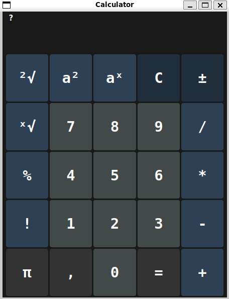

[](https://www.gnu.org/licenses/gpl-3.0.html)
[](https://github.com/Krucek05/IVS-Calculator/releases)

## 📚 Table of Contents
- [Environment](#-environment)
- [GUI-Preview](#-GUI-Preview)
- [Authors](#-authors--team-sudo_apt_install_calculator)
- [Features](#-features)
- [Installation](#-installation)
- [License](#-license)

# 💻 **IVS PROJECT - CALCULATOR**  
---------------------------------

This is a **calculator application** developed as part of the IVS course at Brno University of technology.  .  
Its core purpose is to **evaluate mathematical expressions** and provide  **numerical result** 
---------------------------------

## 🌍 Environment  
**Platform:** Ubuntu 64-bit *(Preferred for project evaluation)*  
✔️ Cross-platform compatible with minor adjustments

---------------------------------

## 🖥️ GUI-Preview
- 🖱️Mouse support: Clickable buttons for all operations
- ⌨️ Keyboard support: Type directly using number keys and operators



---------------------

## 👨‍💻 Authors — Team `Sudo_Apt_Install_Calculator`  
- 🧠 **xrucekk00** → Kristián Rúček  
- 💡 **xfigurf00** → Filip Figúr  
- 🛠️ **xkucikm00** → Miroslav Kučík  
- 🎨 **xseryra00** → Rastislav Šerý  

----------------------------------

## 🛠️ Features  
- ➕ **Basic Operations**: Addition `+`, subtraction `-`, multiplication `*`, and division `/`  
- ❗ **Factorial**: Computes factorial `n!` for non-negative integers  
- ⬆️ **Exponentiation**: Supports `^` for all exponents  
-  √ **General Roots**: Computes general `n`-th roots, including proper error handling for negative inputs  
-  %  **Modulo**: Supports modulo `%` operation, with handling for division by zero

-----------------------------------

## ⚙️ Installation

You can find the [installation package here](https://github.com/Krucek05/IVS-Calculator/releases).

or clone the repository and install dependencies:

```bash
git clone https://github.com/your-username/ivs-calculator.git
cd ivs-calculator
sudo apt install python3-pyqt6  
```

---
## 🧾 License  

Distributed under the **GNU General Public License v3.0**  
Feel free to use, study, and modify this project under the terms of free software.

---